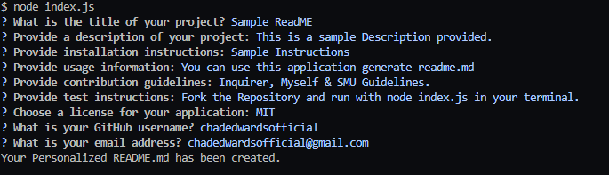

## Generate README

## Introduction
This is a terminal backend application designed to dynamically create a readme based off user input. This application utilizes javascript, inquirer npm and nodejs. Users can customize their own readme without having to use markdown language, all text will be injected into a readme file created.

## Table of Contents
- [Features](#features)
- [Demo](#demo)
- [Installation](#installation)
- [Usage](#usage)
- [Credits](#credits)

## <a name ="features">Features</a>
- Generates ReadME markdown file.
- Takes in user input including license, description and usage instructions.
- Allow users to answer simple questions in terminal to create a well-ready README.md

## <a name ="demo">Demo</a>

Demo video :
https://drive.google.com/file/d/1jq7PqqYaNt5bTrhRs9aLAKRiAnJsUmiP/view

## <a name="installation">Installation</a>
- To run this project locally, follow these steps:
- Clone the repository:
- "$ git clone https://github.com/chadedwardsofficial/generateREADME"

## <a name ="usage">Usage</a>

## <a name ="credits">Credits</a>
- Chad Edwards https://github.com/chadedwardsofficial
- Inquirer @ https://www.npmjs.com/package/inquirer
- SMU Boot Camp & Guidelines